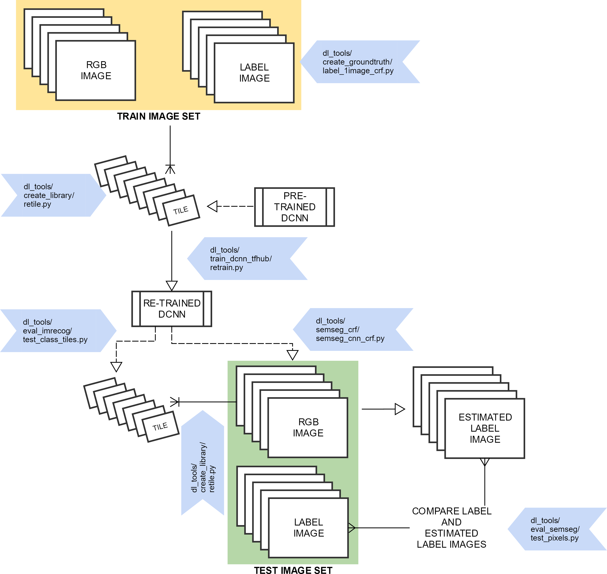

# DL tools

A collection of tools for image classification and recognition using deep transfer learning

Written by Dr Daniel Buscombe
Northern Arizona University
daniel.buscombe@nau.edu

Imagery in ```demo_data``` collected by Jon Warrick, USGS Santa Cruz

This toolbox was prepared for the "MAPPING LAND-USE, HAZARD VULNERABILITY AND HABITAT SUITABILITY USING DEEP NEURAL NETWORKS" project, funded by the U.S. Geological Survey Community for Data Integration, 2018

Thanks: Jenna Brown, Paul Grams, Leslie Hsu, Andy Ritchie, Chris Sherwood, Rich Signell, Jon Warrick

---

## Installation

Open an anaconda terminal and clone this repository from github

```
git clone https://github.com/dbuscombe-usgs/dl_tools.git
```


```
conda env create -f tf_env.yml 
```


You can see that this has been created in your conda env folder, e.g.


``` 
conda activate dl_tools
```


---

## Data

The provided example dataset is organized as follows


---

---

# METHOD 1



## 1) Create test an training data sets

This function is designed to take a folder of images and create a new set of testing and training images based on a specified proportional split. Training images will be used to train a model. Testing images will be used to test that model. 

```
python create_library\images_split_train_test.py -p 0.5
```

* Select a directory of images (to run using the provided demo data, select ```demo_data\jpg```)


* The program will create two new folders, ```train``` and ```test```, randomly select images and copy them into those folders.
* The proportion of total images used for training is set using the ```-p``` flag. For example, 0.5 means half the images will be selected at random and moved to the training folder


---

## 2) Create groundtruth (label) image using the CRF approach outlined by [Buscombe & Ritchie (2018)](http://www.mdpi.com/2076-3263/8/7/244/pdf)

```
python create_groundtruth\label_1image_crf.py -w 500 -s 0.2
```

which says I will be using a 500x500 pixel window of the image at any one time, and the image will be rescaled to 20% of its original size to do the CRF processing (for speed)

* Select an image (you can only work on one image at a time). Currently, JPG, jpg, jpeg, png, PNG, tif, tiff, TIF and TIFF extensions supported


* Select a labels file


* Select a label colors file

* Two windows appear: 1) the entire image and 2) the small ("active") window you are working on at any one time


* The active window has a title according to the class you should label. For example, below the class is 'agricultural' so only annotate agricultural land


* The command window provides instructions for how to advance (hit ```Esc```) and how to change the brush size (use ```+``` and ```-``` keys for larger and smaller brush size, respectively)


* The active annotation is red and the previous annotations (from previous classes) are black. You may 'undo' the last annotation by hitting the ```z``` key


* When you are finished annotating, an algorithm uses the information you provided (pixel intensities of each class and their relative locations) to build a model to predict the classes of each pixel. This usually takes a few minutes


CRF inference time depends primarily on image complexity and size, but is also secondarily affected by the number and spatial heterogeneity of the class labels.

* After a couple of minutes, the labeling is complete. In the same folder as the image (and labels), you should see 4 new files

    * A ".mat" file containing the results. Note, this is NOT a Microsoft access database. It is matlab format. However, you won't need matlab to read this file. 
    * a file ending in "mres.png" that shows the input image, your annotations, and the final estimated label image
    * a ".txt" file that contains a report detailing the relative proportions of each class in the image, and how long it took you to annotate the image
	* another ".png" file that shows a greyscale 8-bit label image

	
* If you are working with a geoTIFF format, there is a special version of this annotation program for geoTIFF format

```
python create_groundtruth\label_1geotiff_crf.py -w 500 -s 1.0
```

There are other python libraries you'll need to use it:

```conda install rasterio gdal```
	
---	
	
[Optional] 
To help speed your test up, twelve ground truth label files are provided in ```demo_data\gt```. Assuming you have executed Step 1 above, you may copy those files into the correct folder (```train``` or ```test```) using

```
python create_library\cp_mat.py
```	

Now if you look inside ```test``` and ```train``` you will see 6 *.mat files per folder 
	
---

## 3) Create a library of image tiles for retraining a DCNN

* You should do this for BOTH ```test``` and ```train``` folders

```
python create_library\retile.py -t 96 -a 0.9 -b 0.5
```

* Select a directory containing mat files generated by 2)
* the ```-t``` flag specifies the tile size that the model will be trained with
* the ```-a``` flag specifies a threshold for the proportion of pixels within each tile that are identical. Tiles with less than this proportion are ignored
* the ```-b``` flag specifies the proportion of resulting randomly selected tiles to keep


---

## 4) Retrain a deep convolutional neural network 

* ```--image_dir``` Location of the directory that contains subdirectories that contain images (or image tiles, as in this example)
Example: demo_data\train\tile_96 

* ```--tfhub_module``` Name of the tensorflow-hub model to use (this example, MobilenetsV2 1.0 96)
Example: https://tfhub.dev/google/imagenet/mobilenet_v2_100_96/classification/1 

* ```--how_many_training_steps``` Number of training epochs
Example: 1000 

* ```--learning_rate ``` This parameter tells the optimizer how far to move the weights in the direction of the gradient for a mini-batch. If the learning rate is low, then training is more reliable, but optimization will take a lot of time because steps towards the minimum of the loss function are tiny. If the learning rate is high, then training may not converge or even diverge. Weight changes can be so big that the optimizer overshoots the minimum and makes the loss worse.

Example: 0.01 

* ```--output_labels ``` Name of the OUTPUT labels file. This is an ascii file that contains one label per row, in alphabetical order
Example: labels.txt 

* ```--output_graph ``` Name of the ".pb" (tensorflow graph) output file
Example: monterey_demo_mobilenetv2_96_1000_001.pb 

* ```--bottleneck_dir ``` This is the name of a temporary directory that the program uses
Example: bottlenecks 

* ```--summaries_dir ``` This is the name of a temporary directory that the program uses
Example: summaries


```
python train_dcnn_tfhub\retrain.py --image_dir demo_data\train\tile_96 --tfhub_module https://tfhub.dev/google/imagenet/mobilenet_v2_100_96/classification/1 --how_many_training_steps 1000 --learning_rate 0.01 --output_labels labels.txt --output_graph monterey_demo_mobilenetv2_96_1000_001.pb --bottleneck_dir bottlenecks --summaries_dir summaries
```

* When it is finished the command prompt should look similar to this:


* Note that this model takes a very long time to train. If you want to skip this step for now, you can download the model [here](https://drive.google.com/open?id=1o8GNz8XX_AxVdDLf_Y3NWbfG436qvUT5) and the associated labels file [here](https://drive.google.com/open?id=1XYkpKZmu1jZsQX72b_FlxKyvMyOxqn5O)

---

## 5) Evaluate image tile classification accuracy

This script evaluates how well the retrained DCNN performs at an 'image recognition' task (could be whole images, or tiles like this example)

```
python eval_imrecog\test_class_tiles.py -n 100
```

* the ```-n``` flag refers to the number of random tiles you wish to evaluate
* Select a directory containing subdirectories of (ideally, ```test```) tiles


* Select a labels file
* Select a model (.pb) file

* When finished, the screen prints accuracy statistics (accuracy, F1 score, and mean posterior probability for the prediction)


* In addition, a confusion matrix is generated (the program saves this in the same top level directory that you specified)


---

## 6) Perform semantic segmentation of an image using the "hybrid" approach outlined by [Buscombe & Ritchie (2018)](http://www.mdpi.com/2076-3263/8/7/244/pdf)

* Make a label colors file (1 color per line, that corresponds to the "labels.txt" file generated in step 4). Example file is downloadable [here](https://drive.google.com/open?id=1XYkpKZmu1jZsQX72b_FlxKyvMyOxqn5O)

* INPUTS (these must be in the correct order)
	* A single image
		* Example: demo_data\test\D800_20160308_221740-0.jpg 
	* The model file (generated in step 4)
		* Example: monterey_demo_mobilenetv2_96_1000_001.pb 
	* The labels.txt file associated with the model (also generated in step 4)
		* Example: labels.txt 
	* A colors file (you need to make this)
		* Example: colors.txt 
	* Tile size. You should use a tile size that is the same as the tile size you used to train the model you intend to run
		* Example: 96 
	* Probability threshold. Only DCNN-predicted labels with probabilities greater than this number will be used in the CRF. The higher this number, the fewer DCNN classifications are used
		* Example: 0.5 
	* The probability of the DCNN prediction. This is used by the CRF but doesn't usually matter to the final result that much. Unless you have a specific reason to change this, leave at 0.5
		* Example: 0.5 
	* Decimation factor. typically, you don't need to predict the class of every tile in the image. This number controls the decimation. 2 = use every second tile, 4 = every 4th tile, etc
		* Example: 8 
	* Image scaling for CRF. to save time during the CRF phase, the image is downscaled (the rescaled back up to the original size). This number controls the scaling: 0.5 means half the original size, 0.25 means a quarter, etc
		* Example: 0.25

```
python semseg_crf\semseg_cnn_crf.py demo_data\test\D800_20160308_221825-0.jpg monterey_demo_mobilenetv2_96_1000_001.pb labels.txt demo_data\labels\monterey_label_colors.txt 96 0.5 0.5 8 0.25
```

* Remember to choose an image that already has an "mres.mat" file, like I did. This is because in the next step you will be comparing "automated" with "manual" label images

* This creates a mat file with the string ```_ares```, which stands for "automated result". Remember the "manual" equivalent (using step 2) created mat files with "_mres"


---

## 7) Evaluate the accuracy of the semantic segmentation 

```
python eval_semseg\test_pixels.py
```

* The program asks you to navigate to a directory that contains results from both automated and manual (ground truth) semantic segmentations on the same images (i.e. "ares" and mres" files, respectively)
* These results files should be the .mat files generated by steps 2 and 6 above, for manual and automated approaches, respectively 
* The program assumes the manual files have the string 'mres' in the filename, and that the automated files have the string 'ares' in the file name
* For each pair of files, the program will compute accuracy metrics (precision, recall, and F1-score) and print them to screen. 
* A confusion matrix will also be printed to file (in the same directory that you specified)


---

---


# METHOD 2

This method is designed to predict pixelwise labels without training on tiles (i.e. it uses pixelwise label images directly to train the model and infer classes on unseen imagery)


## 8) Fully convolutional semantic segmentation, implementing the method of [Long et al 2015](https://people.eecs.berkeley.edu/~jonlong/long_shelhamer_fcn.pdf) 

* Create a labeldefs.txt file, consisting of a category and associated red, green, and blue value (unsigned 8-bit integers). [This](https://www.webpagefx.com/web-design/hex-to-rgb/) is a good resource

* Run the following to make the ground truth images for the training data

```
python semseg_fullyconv\make_labels.py demo_data\data\labels\gtFine\train\data
```

* Run the following to make the ground truth images for the validation data

```
python semseg_fullyconv\make_labels.py demo_data\data\labels\gtFine\val\data
```

* Run the following to train the model (just 10 epochs, for speed)

```
python semseg_fullyconv\train.py --name data_test10 --data-source data --data-dir demo_data\data --epochs 10
```

* Run the following to use the model on unseen imagery to create a label image

```
python semseg_fullyconv\infer.py --name data_test10 --samples-dir demo_data\data\samples\RGB\val\data --output-dir test_output --data-source data
```

* select the labeldefs.txt file
* check the outputs in ```test_output```


* Run the following to use the model on unseen imagery to create a label image with CRF post-processing

```
python semseg_fullyconv\infer_crf.py --name data_test10 --samples-dir demo_data\data\samples\RGB\val\data --output-dir test_output --data-source data
```

* select the labeldefs.txt file
* check the outputs in ```test_output```


